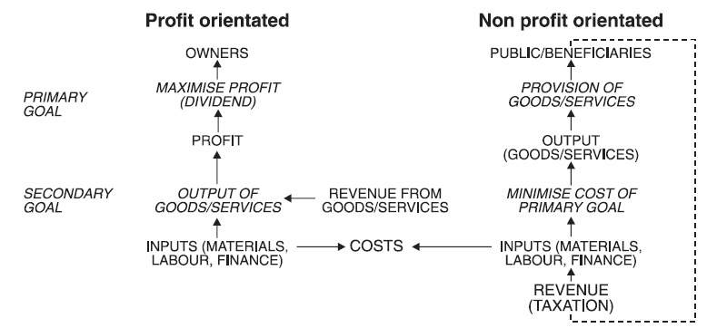
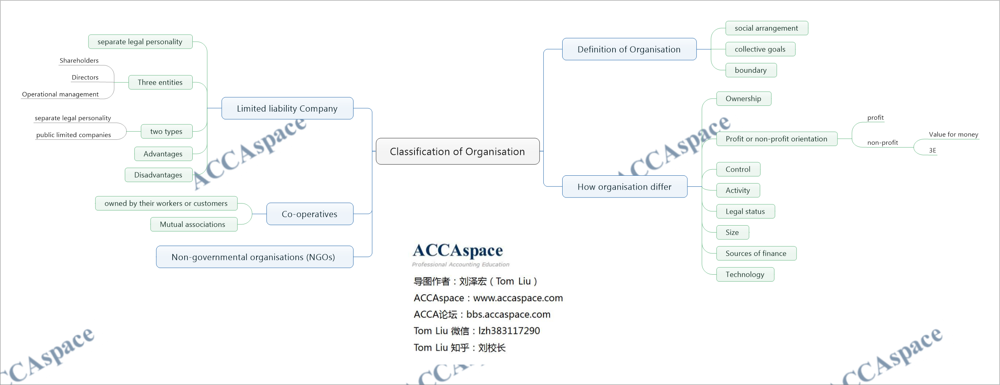

## Definition of Organisation

> An organisation is a social arrangement which pursues collective goals, which controls its own
performance and which has a boundary separating it from its environment.

组织是一个追求集体目标的社会安排，它控制着自己业绩，并有边界将其与环境分开。

## Types of Organisation
How organisations differ?
- Ownership
- Profit or non-profit orientation
- Control
- Activity
- Legal status
- Size
- Sources of finance
- Technology

### Profit vs not-for-profit orientation
收入导向的组织首要目标（Primary Goal）是利润最大化（分红最大化/股东收益最大化），次要目标（Secondary Goal）产出产品和服务（Revenue），同时节省开支（Cost）

非收入导向的组织首要目标是商品和服务，加大产出，次要目标是在实现首要目标的前提下尽量节省成本。

Related to not-for-profit organisation, there are two important concepts:
- Value for money
- 3E (Effectiveness, Efficiency, Economy)

Value for money emphasizes a utility(效用) derived from every purchase or every sum of money spent.

Value for money is based not only on the minimum purchase price (economy) but also on the maximum efficiency and effectiveness of the purchase.

### Private vs public sector
Private sector. Organisations not owned or run by central or local government, or government
Agencies
私人部门：不由中央或地方政府或政府机构拥有或经营的组织。

Public sector. Organisations owned or run by central or local government or government
agencies
公共部门：由中央或地方政府或政府机构拥有或经营的组织。

## Limited Liability Company
A limited company has a separate legal personality from its owners (shareholders). The
shareholders cannot normally be sued for the debts of the business unless they have given some
personal guarantee.
有限公司有与其所有者（股东）相独立的法人资格。除非股东给予了一定的个人担保，否则通常
无法因企业的债务被提起诉讼。

The ownership and control of a limited company are legally separate even though they may be
vested in the same individual or individuals.
有限公司的所有权和控制权在法律上是相分离的，虽然它们可能同时集于个人或一些个人。

Shareholders are the owners.

Directors are appointed by shareholders to run the company.

Operational management usually consists of career managers who are recruited to operate the
Business.

> In the UK, limited companies come in two types: private limited companies (eg X Limited)
and public limited companies (eg X plc).

Difference  | Private limited companies | Public limited companies
---|---|---
Number of shareholders | 少 | 很多
Transferability of shares | 很少转移 | 可以向大众出售
Directors as shareholders | 董事一般持有大部分股份 | 董事一般持有少部分股份
Source of capital | 发起人自有资金、私人募集、风险投资、天使投资、商业团体 | 机构投资者、大众

### Advantages and disadvantages of limited companies
Advantages
- More money is available for investment.
- Risk is reduced for investors thanks to limited liability.
- They have a separate legal personality. A company can own property, make contracts etc.
- Ownership is legally separate from control. Investors need not get involved in operations.
- No restrictions on size apply. Some companies have millions of shareholders.
- It is relatively easy to transfer shares from one owner to another.

Disadvantages
- Legal compliance costs. Because of limited liability, the financial statements of most limited
companies have to be audited, and then published for shareholders.
- Shareholders have little practical power, other than to sell their shares to a new group of
managers, although they can vote to sack the directors.

## Non-governmental Organisation
A non-governmental organisation (NGO) is a legally constituted organisation of people acting
together independently from any form of government.

Non-governmental organisations (NGOs) are bodies which are not directly linked with national
government. The description 'NGO' generally applies to groups whose primary aim is not a
commercial one, but within this the term is applied to a diverse range of activities, aimed at
promoting social, political or environmental change. However, NGOs are not necessarily charities
and, although they may have political aims, they are not political parties.

ACCA is a NGO

## Co-operative
Co-operatives are businesses owned by their workers or customers, who share the profits.

Here are some of the features they have in common.
- Open membership
- Democratic control (one member, one vote)
- Distribution of the surplus in proportion to purchases
- Promotion of education

Mutual associations are similar to co-operatives in that they are 'owned' by their members
rather than outside investors.

