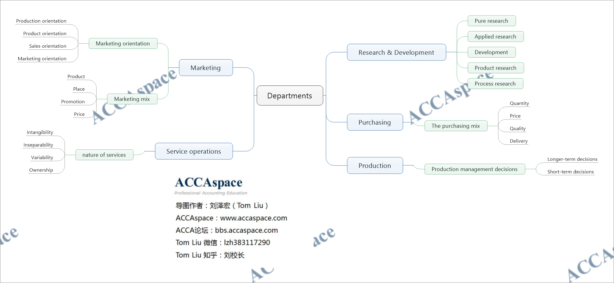
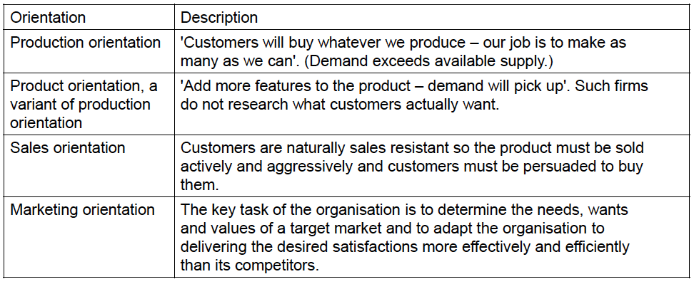

## Research & development
Pure research is original research to obtain new scientific or technical knowledge or understanding.There is no obvious commercial or practical end in view.
纯粹研究为是获得新的科学技术知识或认识而开展的原始研究。并没有明显的商业或实际的目的。

Applied research is also original research work like pure research, but it has a specific practical aim or application (eg research on improvements in the effectiveness of medicines etc).
应用研究和纯粹研究一样，是原始的研究工作，但其具有具体的实际目标或应用目的。（例如研究药
物有效性的改进等）。

Development is the use of existing scientific and technical knowledge to produce new (or substantially improved) products or systems, prior to starting commercial production operations.
开发是在开始商业生产作业之前，利用现有的科学和技术知识来制作新的（或大幅度改善）产品或系
统。

Product research is based on creating new products and developing existing ones.

Process research is based on improving the way in which those products or services are made or
delivered, or the efficiency with which they are made or delivered.

## Purchasing
Purchasing is 'the acquisition of material resources and business services for use by the organisation’.

**The purchasing mix**

The purchasing manager has to obtain the best purchasing mix.
- Quantity
- Price
- Quality
- Delivery

## Production
The production function plans, organises, directs and controls the necessary activities to provide products and services, creating outputs which have added value over the value of inputs.

**Production management decisions**

Longer-term decisions-These are related to setting up the production organisation.
- Selection of equipment and processes
- Job design and methods
- Factory location and layout
- Ensuring the right number and skills of employees

Short-term decisions-These are concerned with the running and control of the organisation.
- Production and control
- Labour control and supervision
- Quality management
- Inventory control
- Maintenance

## Service Operations
Service is any activity of benefit that one party can offer to another that is essentially intangible and does not result in the ownership of anything. Its production may or may not be tied to a physical product.

The nature of services

**Intangibility**

Unlike goods, there are no substantial material or physical aspects to a service. A service cannot be packaged in a bag and carried home, such as a live musical performance.

**Inseparability**

Many services are created at the same time as they are consumed, for example dental treatment.

Associated with this is perishability. Services cannot be stored. The services of a dentist are purchased for a period of time. The service they offer cannot be used later.

**Variability**

It may be hard to attain precise standardisation of the service offered. The quality of the
service may depend heavily on who (or what) delivers the service, and exactly when it takes
place.

**Ownership**

Services differ from consumer goods: they do not normally result in the transfer of property.The
purchase of a service only confers on the customer access to, or a right to use, a facility, not
ownership.

## Marketing
Marketing is 'the management process which identifies, anticipates and satisfies customer needs
profitably’.

Marketing orientation

**Marketing mix**

The marketing mix is the set of controllable variables and their levels that an organisation uses to influence the target market. These variables are product, price, place and promotion and are known as the 4Ps.

4Ps
- Product
- Place
- Promotion
- Price

### Product
Core and augmented product

(a) The core product is a product's essential features.

(b) Augmentations are additional benefits.
### Place
Place covers two main issues.

(a) Outlets. Where products are sold？

(b) Logistics
### Promotion: marketing communications
Promotion is intended to stimulate the potential customer through four behavioural stages:

Awareness of the product

Interest in the product

Desire to buy

Action: an actual purchase

#### Some types of promotion
**Advertising**: newspapers, TV, cinema, internet websites

**Sales promotion**: money-off coupons, 'two for the price of one' offers

**Direct selling**: by sales personnel

**Public relations**: crisis management, obtaining favourable press coverage

### Price
**Penetration pricing**: a low price is charged to persuade as many people as possible to buy the
product in its early stages.

**Skimming**: prices are set to cream off the highest level of profits even though this restricts the number of people able to afford the product.

## NOTE
1.Please try to understand the following concepts

Pure research

Applied research

Development

Product research

Process research

2.Please try to learn the following thoeries

The purchasing mix

Production management decisions

The nature of services

Marketing orientation

Marketing mix

## Practise
7.8 The research and development (R & D) function of a business:

(i) Is primarily concerned with market research

(ii) Can improve existing products as well as developing completely new products

(iii) Has been less important for firms manufacturing computers to meet an industry standard than for
those firms developing the next generation of computers

(iv) Is always undertaken under contract by specialist external consultancies

Which of the above statements are correct?

A (i) and (ii) only

B (ii) and (iii) only

C (i), (iii) and (iv) only

D (ii) and (iv) only (2 marks)

7.9 Services have certain qualities which distinguish them from products. Because of their
........................................ , physical elements such as vouchers, tickets, confirmations and
merchandise are an important part of service provision.

Which of the following words most accurately completes the sentence?

A Intangibility

B Inseparability

C Variability

D Perishability (2 marks)

7.10 U Ltd produces a portfolio of products and focuses its efforts and resources on persuading customers to
buy them.

This is an example of which type of 'orientation'?

A Production

B Sales

C Marketing (1 mark)