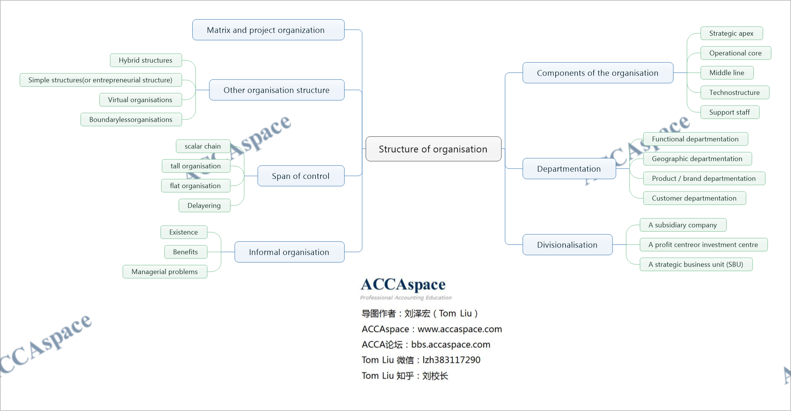
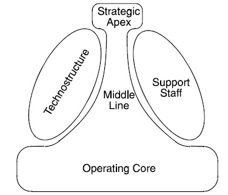
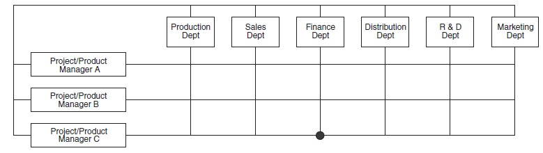

## Components of Organisation

该模型是明兹伯格（Mintzberg）提出的,他相信所有组织都可以分成以下五种成分：
1. Strategic apex（战略顶尖）
2. Operational core（作业核心单元）
3. Middle line（中间层）
4. Technostructure（技术支持单元）
5. Support staff（行政支持单元）

- Strategic apex（战略顶尖）
1. Ensures the organisation follows its mission
2. Manages the organisation's relationship with the environment

- Operational core（作业核心单元）
1. People directly involved in the process of obtaining inputs, and converting them into outputs

- Middle line（中间层）
1. Converts the desires of the strategic apex into the work done by the operating core

- Technostructure（技术支持单元）
1. Analysers determine the best way of doing a job
2. Planners determine outputs (eg goods must achieve a specified level of quality)
3. Personnel analysts standardise skills (eg training programmes)

- Support staff（行政支持单元）
1. Ancillary services（辅助性活动） such as public relations（公关）, legal counsel（法律顾
问）, the cafeteria（餐饮角）. Support staff do not plan or standardise production. They
function independently of the operating core.

## Departmentation

### Functional departmentation 按职能划分部门

Advantages include:

(a) Expertise is pooled thanks to the division of work into specialist areas.

(b) It avoids duplication (部门重复) and enables economies of scale.

(c) It facilitates the recruitment, management and development of functional specialists.

(d) It suits centralised businesses.

Disadvantages include:

(a) It focuses on internal processes and inputs, rather than the customer and outputs, which are
what ultimately drive a business. Inward-looking businesses are less able to adapt to changing
demands.(官僚作风)

(b) Communication problems may arise between different functions, which each have their own
Jargon(行话).

(c) Poor co-ordination.(踢皮球)

(d) Functional structures create vertical barriers to information and work flow.

### Geographic departmentation 按地区划分部门

Advantages:

(a) There is local decision-making at the point of contact between the organisation (eg a
salesperson) and its customers, suppliers or other stakeholders.

(b) It may be cheaper to establish area factories/offices than to service markets from one
location (eg costs of transportation and travelling may be reduced).

Disadvantages:

(a) Duplication and possible loss of economies of scale might arise.

(b) Inconsistency in methods or standards may develop across different areas.

### Product / brand departmentation 按产品和品牌划分部门

Advantages include:

(a) Accountability. Individual managers can be held accountable for the profitability of individual products.

(b) Specialisation.

(c) Co-ordination. The different functional activities and efforts required to make and sell each
product can be co-ordinated and integrated by the divisional/product manager.

Disadvantages include:

(a) It increases the overhead costs and managerial complexity of the organisation.

(b) Different product divisions may fail to share resources and customers.
Customer departmentation 按客户划分部门（适合有少数几个大客户的企业）

### Customer departmentation 按客户划分部门（适合有少数几个大客户的企业

## Divisionalisation

Divisionalisation is the division of a business into autonomous regions or product businesses,
each with its own revenues, expenditures and capital asset purchase programmes, and
therefore each with its own profit and loss responsibility.

Each division of the organisation might be:
- A subsidiary company under the holding company
- A profit centre or investment centre within a single company
- A strategic business unit (SBU) within the larger company, with its own objectives

Advantages

- Focuses the attention of management below ‘top level' on business performance
- Reduces the likelihood of unprofitable products and activities being continued.
- Encourages a greater attention to efficiency, lower costs and higher profits.
- Gives more authority to junior managers, and so grooms them for more senior positions in the
future.

Disadvantages
- In some businesses, it is impossible to identify completely independent products or markets
for which separate divisions can be set up.
- There may be more resource problems. Many divisions get their resources from head office in
competition with other divisions.

## Matrix and project organisation

Where hybrid organisation 'mixes' organisation types, matrix organisation actually crosses
functional and product/customer/project organisation.

该结构常见于事务所等组织。

Advantages of matrix organisation include:

1. Greater flexibility of:
    1. People. Employees develop an attitude geared to accepting change, and departmental
monopolies are broken down.
    2. Workflow and decision-making. Direct contact between staff encourages problem solving
and big-picture thinking.
    3. Tasks and structure. The matrix structure may be readily amended, once projects are
completed.
2. Inter-disciplinary co-operation and a mixing of skills and expertise, along with improved
communication and co-ordination
3. Motivation and employee development: providing employees with greater participation in
planning and control decisions
4. Market awareness: the organisation tends to become more customer/quality focused
5. Horizontal workflow: bureaucratic obstacles are removed, and department specialisms
become less powerful

Disadvantages, however.

(a) Dual authority threatens a conflict between functional managers and product/project/area
managers.

(b) An individual with two or more bosses may suffer stress from conflicting demands or
ambiguous roles.

(c) Cost: product management posts are added, meetings have to be held, and so on.

(d) Slower decision-making due to the added complexity.

## Other Organisation Structure

Hybrid structures 混合制组织结构

Simple structures(or entrepreneurial structure) 简单组织结构

Virtual organisations 虚拟组织

Boundaryless organisations 无边界组织

## Span of Control

The span of control refers to the number of subordinates immediately reporting to a superior
official.

A number of factors influence the span of control.

The scalar chain(指挥链) is the chain of command from the most senior to the most junior.

A tall organisation is one which, in relation to its size, has a large number of levels of
management hierarchy. This implies a narrow span of control.

A flat organisation is one which, in relation to its size, has a small number of hierarchical levels.
This implies a wide span of control.

Delayering is the reduction of the number of management levels from bottom to top.

## Informal Organisation

An informal organisation always exists alongside the formal one.

When people work together, they establish social relationships and customary ways of doing
things. Unlike the formal organisation, the informal organisation is loosely structured, flexible and
spontaneous(自发形成的).

Benefits (or the role of) the informal organization
- Employee commitment
- Knowledge sharing
- Speed
- Responsiveness(对环境变化反映较快)
- Co-operation

**Managerial problems of informal organization**
- May act collectively against organisational interests
- Grapevine
- Individuals can suffer when excluded from social networks.
- Informal work practices may 'cut corners’

**Managers can minimise problems by:**
- Meeting employees' needs as far as possible via the formal organisation: providing information,
encouragement, social interaction, and so on
- Taking the advantage of the dynamics(活力) of the informal organisation – for example by using
informal leaders to secure employee commitment to goals or changes
- Involving managers themselves in the informal structure, so that they support information sharing,
the breaking down of unhelpful rules, and so on.

# NOTE

1. Please try to define the following concepts

Divisionalisation

2. Please try to understand the following concepts

Strategic apex
Matrix and project organization

Operational core
Span of control

Operational core
Tall organisation/flat organisation

Technostructure
Delayering

Support staff
Informal organisation

3. Please try to learn the following thoeries

Advantages and disadvantages of functional departmentation

Advantages and disadvantages of geographic departmentation

Advantages and disadvantages of product / brand departmentation

Advantages and disadvantages of divisionalisation

Advantages and disadvantages of matrix and project organization

# Practise

bpp kit 6.1/6.2/6.3/6.4/6.5/6.6/6.8/6.9

